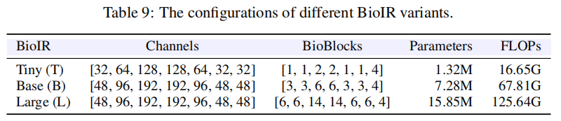
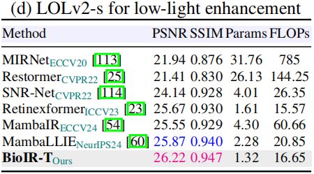

TODO

- lolv2-real同一对图像不同名
- 解释一下train.sh，能不能使用一个命令即可
- 

# 论文原始结果

原始仓库：https://github.com/c-yn/BioIR

单一退化的可视化结果：[百度网盘](https://pan.baidu.com/s/18EIFlLx-xSQRIoLc62Qt6A?pwd=x65n)






# 复现

只复现Single_Composite中单一退化的LOLv2-syn，其他的复合退化、All-in-one没有关注


## 配置环境

配置conda环境：

```
conda create -n bioir python=3.9
conda activate bioir

# 安装依赖
conda install pytorch=2.4.0 torchvision pytorch-cuda=12.4 -c pytorch
pip install opencv-python lmdb tqdm einops scipy scikit-image tensorboard natsort pyiqa joblib lpips scikit-learn pandas

# 安装basicsr
cd Single_Composite
python setup.py develop --no_cuda_ext
```


## 下载数据集

数据集：LOLv1、LOLv2

- BioIR只在LOL-v2-syn上训练，没有在LOLv1和LOLv2-real训练

```
python3 -m pip install -U gdown
gdown "https://drive.google.com/uc?id=1mAN3ll5wWwt1Xz0C7uio31-NJu-50S8Z"
gdown "https://drive.google.com/uc?id=1dzLJFz0svHXYHvAe-Tl52miChhF4BXXE"

apt install -y unzip
unzip LOL-v1.zip -d LOLv1
unzip LOL-v2.zip -d LOLv2
```

目录结构

```
Single_Composite/
  datasets/
    LOLv1/
      train/low/
      train/high/
      test/low/
      test/high/
    LOLv2-syn/
      train/low/
      train/high/
      test/low/
      test/high/
    LOLv2-real/
      train/low/
      train/high/
      test/low/
      test/high/
```

**修改yaml配置**：

```
datasets:
  train:
    dataroot_lq: path/to/train/low_or_input
    dataroot_gt: path/to/train/high_or_target
  val:
    dataroot_lq: path/to/test/low_or_input
    dataroot_gt: path/to/test/high_or_target
```


## 测试

下载预训练权重，放到``pretrain_model`：[Google Drive](https://drive.google.com/drive/folders/1VrFxqox3fewPUmP-i0a9rJw3qCmT1Vnp?usp=sharing)、[百度网盘](https://pan.baidu.com/s/1AEieYLl5i-afkr-bF47a_g?pwd=ja58)

原始测试流程：原脚本里的 `--data` 枚举没有区分 `LOL-v1`、`LOL-v2-syn`、`LOL-v2-real`，并且默认按 `pretrain_model/<data>.pth` 找权重；如果继续用原脚本，需要同时修改 `eval.py`、`metrics_score.py` 和数据集枚举。

```
# 可视化实验：输出增强图
python eval.py --data CSD
# 定量实验：计算PSNR、SSIM
python metrics_score.py --data CSD
```

新建`test_lol.py`：同时完成推理、保存增强图、按同名 GT 计算 PSNR/SSIM，并把每张图和平均指标写入 `metrics.csv`。

**下载的 BioIR 预训练权重**：放在`BioIR/Single_Composite/pretrained_models/`

```
python test_lol.py --opt options/LOL-v1.yml --weights pretrained_models/BioIR_LOLv1.pth

# LOLv1
python test_lol.py --opt options/LOL-v1.yml --weights experiments/BioIR-LOLv1/models/net_g_latest.pth
# LOLv2-syn
python test_lol.py --opt options/LOL-v2-syn.yml --weights experiments/BioIR-LOLv2-syn/models/net_g_latest.pth
# LOLv2-real
python test_lol.py --opt options/LOL-v2-real.yml --weights experiments/BioIR-LOLv2-real/models/net_g_latest.pth
```


输出位置：

```text
results_lol/<实验名>/
  restored/      # 增强后图片
  metrics.csv    # 每张图和平均 PSNR/SSIM
```

默认按 RGB 三通道计算 PSNR/SSIM。如果你要和只报 Y 通道的论文口径对齐，可以加：

```powershell
python test_lol.py --opt options/LOL-v1.yml --weights experiments/BioIR-LOLv1/models/net_g_latest.pth --test_y_channel
```

如果想额外保存低光图/增强图/GT 的横向拼接对比图：

```powershell
python test_lol.py --opt options/LOL-v1.yml --weights experiments/BioIR-LOLv1/models/net_g_latest.pth --save_comparison
```


## 训练

**周期性输出评价指标、保存模型权重和断点状态**

```
val:
  val_freq: 1e3

logger:
  save_checkpoint_freq: 1e3
```

**保存目录**：

```
Single_Composite\experiments\<实验名>\
  models\
  training_states\
  
# 示例
Single_Composite\experiments\BioIR-LOLv1\models\net_g_1000.pth
Single_Composite\experiments\BioIR-LOLv1\models\net_g_latest.pth
Single_Composite\experiments\BioIR-LOLv1\training_states\1000.state
```

在 `Single_Composite` 目录运行。Windows PowerShell 推荐直接用 `torchrun`：

```powershell
torchrun --nproc_per_node=1 --master_port=4322 basicsr/train.py -opt options/LOL-v1.yml --launcher pytorch
torchrun --nproc_per_node=1 --master_port=4322 basicsr/train.py -opt options/LOL-v2-syn.yml --launcher pytorch
torchrun --nproc_per_node=1 --master_port=4322 basicsr/train.py -opt options/LOL-v2-real.yml --launcher pytorch
```

Linux 或 Git Bash 也可以继续用原脚本：

```bash
sh train.sh options/LOL-v1.yml
sh train.sh options/LOL-v2-syn.yml
sh train.sh options/LOL-v2-real.yml
```

每个实验的权重会保存到：

```text
experiments/BioIR-LOLv1/models/net_g_latest.pth
experiments/BioIR-LOLv2-syn/models/net_g_latest.pth
experiments/BioIR-LOLv2-real/models/net_g_latest.pth
```

训练中断后，原训练脚本会自动从 `experiments/<实验名>/training_states/` 里最新的 `.state` 恢复。如果你想完全重新训练同名实验，需要先移动或删除对应实验目录。


## 消融实验


# 代码学习

## 网络模块


## 损失函数
