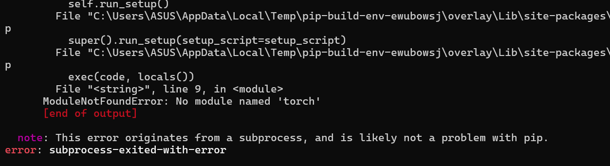
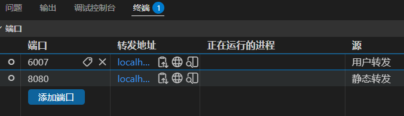
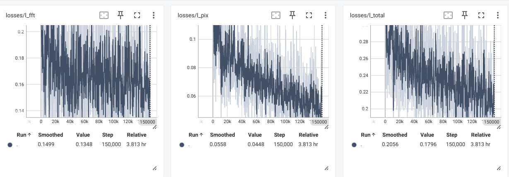
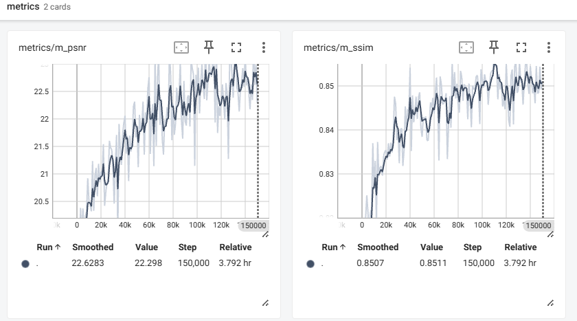
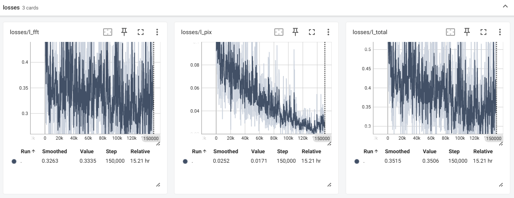
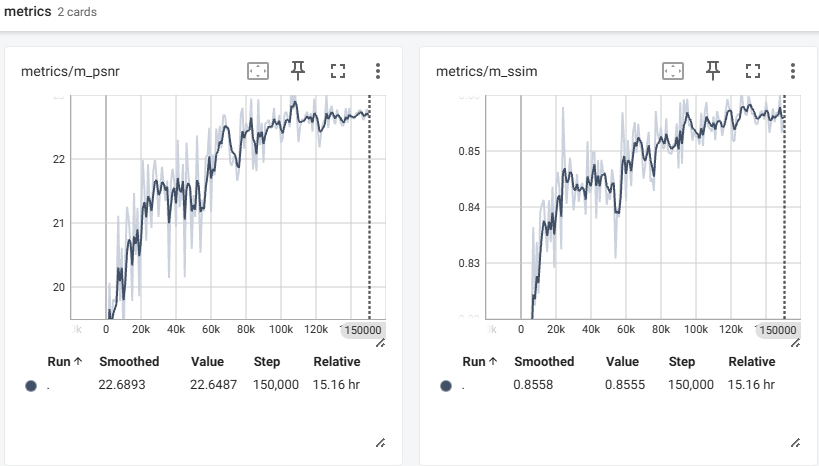
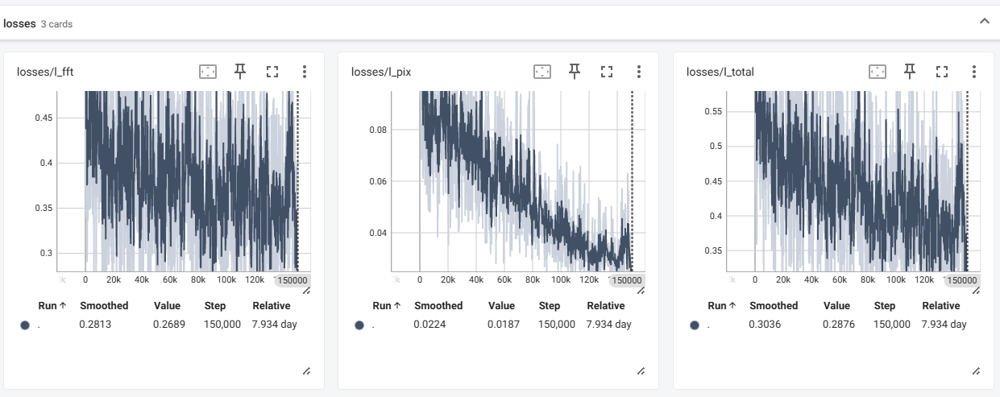
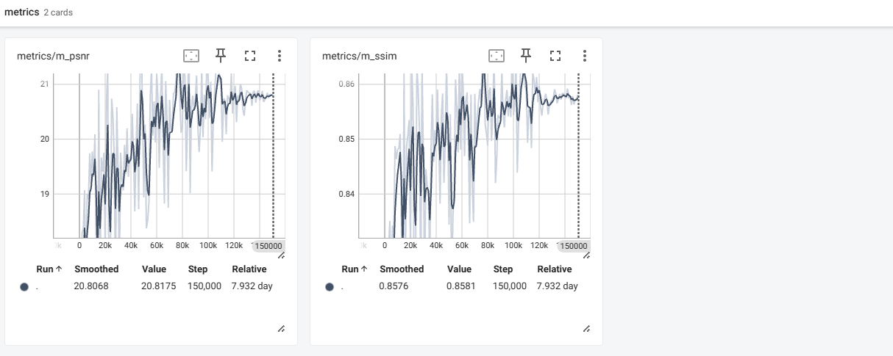
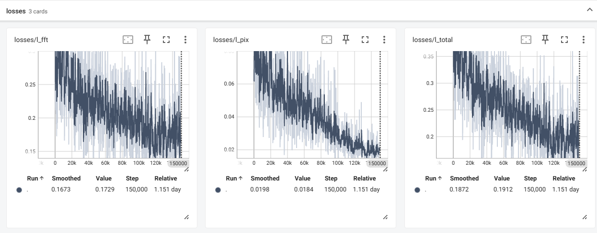
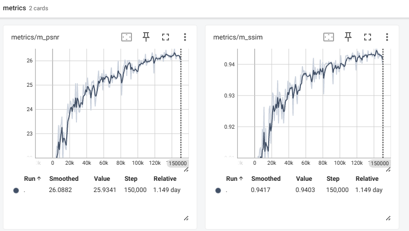

todo

- tensorboard：训练轮次、学习率、总损失、分损失、每次测试的PSNR和SSIM

# 论文原始结果

原始仓库：https://github.com/c-yn/BioIR

单一退化的可视化结果：[百度网盘](https://pan.baidu.com/s/18EIFlLx-xSQRIoLc62Qt6A?pwd=x65n)


# 复现

只复现Single_Composite中单一退化的LOLv2-syn，其他的复合退化、All-in-one没有关注


## 配置环境

配置conda环境：

```
conda remove -n bioir --all -y
conda create -n bioir python=3.9 -y 
conda activate bioir

# 安装依赖
# conda install pytorch=2.4.0 torchvision pytorch-cuda=12.4 -c pytorch -c nvidia -y
pip install --no-cache-dir torch==2.4.0 torchvision==0.19.0 torchaudio==2.4.0 --index-url https://download.pytorch.org/whl/cu124
pip install opencv-python lmdb tqdm einops scipy scikit-image tensorboard natsort pyiqa joblib lpips scikit-learn pandas

# 安装basicsr
git clone https://github.com/jaxhur/BioIR.git
git clone https://gitee.com/wallcaptain/BioIR.git

cd BioIR/Single_Composite
# 把 setuptools 降到 64 以下，并确保有 wheel。原因是你当前的新版 setuptools/pip 会用“隔离构建环境”，那个临时环境里看不到你已经安装好的 torch，所以报 No module named 'torch'。
python -m pip install "setuptools<64" wheel
python setup.py develop --no_cuda_ext
```

如果不降级新版 setuptools/pip 会用“隔离构建环境”，那个临时环境里看不到你已经安装好的 torch，所以报 No module named 'torch'。




## 下载数据集

数据集：LOLv1、LOLv2

- BioIR只在LOL-v2-syn上训练，没有在LOLv1和LOLv2-real训练

```
pip install -U gdown
apt install -y unzip

cd ./datasets
# LOL-v1
gdown "https://drive.google.com/uc?id=1mAN3ll5wWwt1Xz0C7uio31-NJu-50S8Z"
# LOL-v2原始
# gdown "https://drive.google.com/uc?id=1dzLJFz0svHXYHvAe-Tl52miChhF4BXXE"
# LOL-v2重命名
gdown "https://drive.google.com/uc?id=1L0UnJg6gZ4Eb7It2EuNxP0L3lQNmKMaP"

# AUtoDL
cp /root/autodl-fs/LOL-v1.zip /root/BioIR/Single_Composite/datasets
cp /root/autodl-fs/LOL-v2-renamed.zip /root/BioIR/Single_Composite/datasets


# 
cd /root/BioIR/Single_Composite/datasets
unzip LOL-v1.zip -d LOL-v1
unzip LOL-v2-renamed.zip -d LOL-v2
```


目录结构

```
Single_Composite/
  datasets/
    LOL-v1/
      our485/
        low/
        high/
      eval15/
        low/
        high/
    LOL-v2/
      Synthetic/
        Train/
          Low/
          Normal/
        Test/
          Low/
          Normal/
      Real_captured/
        Train/
          Low/
          Normal/
        Test/
          Low/
          Normal/
```

**修改yaml配置**：

```
datasets:
  train:
    dataroot_gt: ./datasets/LOL-v2/Synthetic/Train/Normal
    dataroot_lq: ./datasets/LOL-v2/Synthetic/Train/Low、
  val:
    dataroot_gt: ./datasets/LOL-v2/Synthetic/Test/Normal
    dataroot_lq: ./datasets/LOL-v2/Synthetic/Test/Low
```


## 测试

下载预训练权重，放到`pretrained_models/`：[Google Drive](https://drive.google.com/drive/folders/1VrFxqox3fewPUmP-i0a9rJw3qCmT1Vnp?usp=sharing)、[百度网盘](https://pan.baidu.com/s/1AEieYLl5i-afkr-bF47a_g?pwd=ja58)

**原始的测试流程**✖：原脚本里的 `--data` 枚举没有区分 `LOL-v1`、`LOL-v2-syn`、`LOL-v2-real`，并且默认按 `pretrain_model/<data>.pth` 找权重；如果继续用原脚本，需要同时修改 `eval.py`、`metrics_score.py` 和数据集枚举。因此建议直接用下面的新脚本 `test_lol.py`。

```
# 可视化实验：输出增强图
python eval.py --data CSD
# 定量实验：计算PSNR、SSIM
python metrics_score.py --data CSD
```

新建的`test_lol.py`⭐：同时完成推理、保存增强图、按同名 GT 计算 PSNR/SSIM，并把每张图和平均指标写入 `metrics.csv`。

**下载的 BioIR 预训练权重**：放在`BioIR/Single_Composite/pretrained_models/`

- 3080ti：40s完成测试

```
# 下载预训练权重
cd ../pretrained_models
gdown "https://drive.google.com/uc?id=1yyoQOAyU9clo7cDwaT9i0Fgcr8109PDY"
cd ../
#cd Single_Composite

# 测试下载的预训练权重示例
python test_lol.py --opt options/LOL-v2-syn.yml --weights pretrained_models/LOL-v2-syn.pth
# 额外保存低光图/增强图/GT 的横向拼接对比图
python test_lol.py --opt options/LOL-v2-syn.yml --weights pretrained_models/LOL-v2-syn.pth --save_comparison

# 测试自己训练出的权重
# LOL-v1
python test_lol.py --opt options/LOL-v1.yml --weights experiments/BioIR-LOLv1/models/net_g_latest.pth
# LOL-v2-syn
python test_lol.py --opt options/LOL-v2-syn.yml --weights experiments/BioIR-LOLv2-syn/models/net_g_latest.pth
# LOL-v2-real
python test_lol.py --opt options/LOL-v2-real.yml --weights experiments/BioIR-LOLv2-real/models/net_g_latest.pth
```

输出位置：

```text
results_lol/<实验名>/
  restored/      # 增强后图片
  metrics.csv    # 每张图和平均 PSNR/SSIM
```

默认按 RGB 三通道计算 PSNR/SSIM。如果你要和只报 Y 通道的论文口径对齐，可以加：

```powershell
python test_lol.py --opt options/LOL-v1.yml --weights experiments/BioIR-LOLv1/models/net_g_latest.pth --test_y_channel
```

> 问题：貌似是安装的是CPU版本的torch
>
> ```
> File "/workspace/BioIR/Single_Composite/basicsr/models/__init__.py", line 4, in <module>
>  from basicsr.utils import get_root_logger, scandir
> File "/workspace/BioIR/Single_Composite/basicsr/utils/__init__.py", line 2, in <module>
>  from .img_util import crop_border, imfrombytes, img2tensor, imwrite, tensor2img, padding, padding_DP, imfrombytesDP
> File "/workspace/BioIR/Single_Composite/basicsr/utils/img_util.py", line 6, in <module>
>  from torchvision.utils import make_grid
> File "/venv/bioir/lib/python3.9/site-packages/torchvision/__init__.py", line 10, in <module>
>  from torchvision import _meta_registrations, datasets, io, models, ops, transforms, utils  # usort:skip
> File "/venv/bioir/lib/python3.9/site-packages/torchvision/_meta_registrations.py", line 164, in <module>
>  def meta_nms(dets, scores, iou_threshold):
> File "/venv/bioir/lib/python3.9/site-packages/torch/library.py", line 654, in register
>  use_lib._register_fake(op_name, func, _stacklevel=stacklevel + 1)
> File "/venv/bioir/lib/python3.9/site-packages/torch/library.py", line 154, in _register_fake
>  handle = entry.abstract_impl.register(func_to_register, source)
> File "/venv/bioir/lib/python3.9/site-packages/torch/_library/abstract_impl.py", line 31, in register
>  if torch._C._dispatch_has_kernel_for_dispatch_key(self.qualname, "Meta"):
> RuntimeError: operator torchvision::nms does not exist
> 
> ```
>
> 1
>
> ```
> python -c "import torch; print(torch.__version__, torch.version.cuda, torch.cuda.is_available())"
> pip install --no-cache-dir torch==2.4.0 torchvision==0.19.0 torchaudio==2.4.0 --index-url https://download.pytorch.org/whl/cu124
> ```
>
> 


## 测试结果

LOLv2-syn

- Average：PSNR=26.217035，SSIM=0.940082


## 训练

原始 README用 `torchrun`。它是 PyTorch 分布式启动器，即使只有 1 张 GPU，也按“单进程分布式”方式跑。普通单卡实验不需要优先用它；原生 Windows 上还可能因为 `nccl` 分布式后端不可用而报错。

```
# win
torchrun --nproc_per_node=1 --master_port=4322 basicsr/train.py -opt options/LOL-v1.yml --launcher pytorch
torchrun --nproc_per_node=1 --master_port=4322 basicsr/train.py -opt options/LOL-v2-syn.yml --launcher pytorch
torchrun --nproc_per_node=1 --master_port=4322 basicsr/train.py -opt options/LOL-v2-real.yml --launcher pytorch

# linux
sh train.sh options/LOL-v1.yml
sh train.sh options/LOL-v2-syn.yml
sh train.sh options/LOL-v2-real.yml
```

**周期性输出评价指标、保存模型权重和断点状态**

- 训练中断后，原训练脚本会自动从 `experiments/<实验名>/training_states/` 里最新的 `.state` 恢复

```
val:
  val_freq: 1e3

logger:
  save_checkpoint_freq: 1e3
```

**数据会保存如下目录**：

```
Single_Composite\experiments\<实验名>\
  models\
  training_states\
  
# 示例
Single_Composite\experiments\BioIR-LOLv1\models\net_g_1000.pth
Single_Composite\experiments\BioIR-LOLv1\models\net_g_latest.pth
Single_Composite\experiments\BioIR-LOLv1\training_states\1000.state
```


## LOLv1

batchsize=32使用3080ti 12g会爆显存，batchsize=8、patch=128才差不多😅

我靠要，3080ti要训练2天😅

- `epoch: 13`：当前第 13 个 epoch，但这个项目主要按 `iter` 控制训练，不是按 epoch 结束。
- `iter: 800`：全局训练步数，现在第 800 步。
  - total_iter=300000太大了，一般15万、10万差不多
  - 我先改成150000，如果效果不行，根据权重继续训练到300000，但是学习率采用退火，不一定一样
- `lr`：学习率，现在是 `1e-3`。
- `eta`：预计剩余训练时间。
- `time (data): 0.500 (0.002)`：每步约 0.5 秒，其中读数据只花 0.002 秒，说明主要时间在模型计算。
- `l_pix`：像素级 L1 loss。
- `l_fft`：频域 FFT loss。

```
2026-07-01 13:44:24,487 INFO: [BioIR..][epoch:  9, iter:     600, lr:(1.000e-03,)] [eta: 2 days, 1:17:14, time (data): 0.400 (0.001)] l_pix: 2.5254e-01 l_fft: 2.0704e-01 
2026-07-01 13:45:22,187 INFO: [BioIR..][epoch: 11, iter:     700, lr:(1.000e-03,)] [eta: 2 days, 1:05:07, time (data): 0.500 (0.002)] l_pix: 1.4189e-01 l_fft: 2.2359e-01 
2026-07-01 13:46:18,987 INFO: [BioIR..][epoch: 13, iter:     800, lr:(1.000e-03,)] [eta: 2 days, 0:50:11, time (data): 0.500 (0.002)] l_pix: 1.1954e-01 l_fft: 1.4908e-01 
2026-07-01 13:47:16,387 INFO: [BioIR..][epoch: 14, iter:     900, lr:(1.000e-03,)] [eta: 2 days, 0:41:41, time (data): 0.400 (0.002)] l_pix: 1.0878e-01 l_fft: 2.0784e-01 
2026-07-01 13:48:17,587 INFO: [BioIR..][epoch: 16, iter:   1,000, lr:(1.000e-03,)] [eta: 2 days, 0:53:36, time (data): 0.500 (0.002)] l_pix: 1.1841e-01 l_fft: 1.5606e-01 
```

报错：代码把“单卡非分布式验证”错误地转成了“分布式验证”，但你没有用分布式方式启动训练。

```
2026-07-01 13:44:24,487 INFO: [BioIR..][epoch:  9, iter:     600, lr:(1.000e-03,)] [eta: 2 days, 1:17:14, time (data): 0.400 (0.001)] l_pix: 2.5254e-01 l_fft: 2.0704e-01 
2026-07-01 13:45:22,187 INFO: [BioIR..][epoch: 11, iter:     700, lr:(1.000e-03,)] [eta: 2 days, 1:05:07, time (data): 0.500 (0.002)] l_pix: 1.4189e-01 l_fft: 2.2359e-01 
2026-07-01 13:46:18,987 INFO: [BioIR..][epoch: 13, iter:     800, lr:(1.000e-03,)] [eta: 2 days, 0:50:11, time (data): 0.500 (0.002)] l_pix: 1.1954e-01 l_fft: 1.4908e-01 
2026-07-01 13:47:16,387 INFO: [BioIR..][epoch: 14, iter:     900, lr:(1.000e-03,)] [eta: 2 days, 0:41:41, time (data): 0.400 (0.002)] l_pix: 1.0878e-01 l_fft: 2.0784e-01 
2026-07-01 13:48:17,587 INFO: [BioIR..][epoch: 16, iter:   1,000, lr:(1.000e-03,)] [eta: 2 days, 0:53:36, time (data): 0.500 (0.002)] l_pix: 1.1841e-01 l_fft: 1.5606e-01 
2026-07-01 13:48:17,587 INFO: Saving models and training states.
2026-07-01 13:48:17,800 WARNING: nondist_validation is not implemented. Run dist_validation.
Test 1: 100%|██████████████████████████████████████████████████████████████████████████████████████████████████████████████████████████████████████| 15/15 [00:18<00:00,  1.21s/image]
Traceback (most recent call last):
  File "/workspace/BioIR/Single_Composite/basicsr/train.py", line 300, in <module>
    main()
  File "/workspace/BioIR/Single_Composite/basicsr/train.py", line 265, in main
    model.validation(val_loader, current_iter, tb_logger,
  File "/workspace/BioIR/Single_Composite/basicsr/models/base_model.py", line 51, in validation
    return self.nondist_validation(dataloader, current_iter, tb_logger,
  File "/workspace/BioIR/Single_Composite/basicsr/models/image_restoration_model.py", line 441, in nondist_validation
    self.dist_validation(*args, **kwargs)
  File "/workspace/BioIR/Single_Composite/basicsr/models/image_restoration_model.py", line 421, in dist_validation
    torch.distributed.reduce(metrics, dst=0)
  File "/venv/bioir/lib/python3.9/site-packages/torch/distributed/c10d_logger.py", line 79, in wrapper
    return func(*args, **kwargs)
  File "/venv/bioir/lib/python3.9/site-packages/torch/distributed/distributed_c10d.py", line 2395, in reduce
    default_pg = _get_default_group()
  File "/venv/bioir/lib/python3.9/site-packages/torch/distributed/distributed_c10d.py", line 1025, in _get_default_group
    raise ValueError(
ValueError: Default process group has not been initialized, please make sure to call init_process_group.
```

解决方案

```
# 使用torchrun
cd /workspace/BioIR/Single_Composite
torchrun --nproc_per_node=1 --master_port=4322 basicsr/train.py -opt options/LOL-v1.yml --launcher pytorch
# 或者使用train.sh
sh train.sh options/LOL-v1.yml
```


500个epoch已经算大的吗？他这个怎么要5000个epoch

```
LOL-v1：
训练集图片数：485
batch size：8
每个 epoch ≈ ceil(485 / 8) = 61 iter
所以：
300000 iter ≈ 4920 epoch
150000 iter ≈ 2460 epoch
100000 iter ≈ 1640 epoch
60000 iter  ≈ 984 epoch
```


加上tensorboard，查看情况：修改了部分代码

- TensorBoard 横轴现在用 **真实 iter**，不是原来归一化后的 `0-10000` step。
- 会记录：
  - `losses/l_pix`
  - `losses/l_fft`
  - `losses/l_total`
  - `train/lr_g_0`
  - `time/iter`
  - `time/data`
- TensorBoard 日志目录统一到 `Single_Composite/tb_logger/<实验名>`。
- 加了一个小测试验证 TensorBoard step 和学习率/耗时记录行为。
- `print_freq` 是 `100`，所以大约每 100 iter 写一次曲线

```
tensorboard --logdir tb_logger --port 6006
http://localhost:6006
```


流程：

- 服务器上启动TensorBoard：tensorboard --logdir ./BioIR/Single_Composite/tb_logger/BioIR-LOLv1 --host 0.0.0.0 --port 6007

  - 要注意这里的路径
  - 读取 tb_logger 目录里的训练日志，让 TensorBoard 监听服务器所有网卡地址，服务端口是 6007

- vscode开启端口转发：或者手动转发ssh -L 6007:127.0.0.1:6007 root@服务器IP -p SSH端口

  

- 本地浏览器：http://localhost:6007


### 训练1：bs=8\ps=128\total-iter=15万\t_max=30万

训练：4090 24G 81TFLOPS

- 3个半小时、占用7G显存、78%的GPU占用率
- batch_size=8
- patch_size=128
- total-iter=15万
- t_max=30万：和total-iter=15万不匹配，导致学习率还在退火中段，不算真正收敛

```
sh train.sh options/LOL-v1.yml
tensorboard --logdir tb_logger --port 6006
```






测试：怎么这么低😅，PSNR很低，SSIM一般的程度

- Average PSNR：22.327381 dB
- Average SSIM: 0.847639

```
python test_lol.py --opt ./options/LOL-v1.yml --weights ./pretrained_models/net_g_latest.pth --save_comparison
```

> YY的参数设置
>
> - 训练轮数：500 epochs
> - 训练集：混合 `LOL-v1 + LOL-v2 Real`，这个有点乱搞了吧🤔，不能混起来训练吧
> - batch size：4
> - patch size：256 x 256
>
> 训练次数的问题：
>
> - `epoch` 是“把训练集完整跑一遍”。
> - `iteration/iter` 是“跑一个 batch，并更新一次参数”。
> - 每个 epoch 的 iter 数 = ceil(训练图片对数 / batch_size)，总 iter 数 = epoch 数 * 每个 epoch 的 iter 数
> - BioIR的LOLv1中，485 对图片，batch_size= 8，total_iter=150000；每个 epoch = ceil(485 / 8) = 61 iter；150000 iter ≈ 150000 / 61 ≈ 2460 epoch；看起来是“两千多个 epoch”，但其实只是因为 LOL-v1 太小，一个 epoch 才 61 次参数更新。
> - YY的epochs=500，batch_size= 4，LOL-v1+LOL-v2-real合计1174 对；每个 epoch = ceil(1174 / 4) = 294 iter，500 epoch ≈ 500 * 294 = 147000 iter
> - 总的更新参数的次数差不多，都是15万次


### 训练2：bs=4\ps=256\total-iter=15万\t_max=30万

bs=8\patch_size=256：爆显存

训练：4090 24G 81TFLOPS

- 7个半小时、占用12G显存、97%的GPU占用率
- batch_size=4
- patch_size=256
- total-iter=15万
- t_max=15万

```
cd /root/BioIR/Single_Composite
sh train.sh options/LOL-v1.yml
tensorboard --logdir ./Single_Composite/tb_logger/BioIR-LOLv1 --port 6006
```


测试：PSNR中途到达过23.5、SSIM达到较好水平

- Average PSNR: 22.677198 dB
- Average SSIM: 0.855080

```
python test_lol.py --opt ./options/LOL-v1.yml --weights ./pretrained_models/net_g_latest.pth --save_comparison
```






## LOLv2-real

训练：4090 24G 81TFLOPS

- 10个小时、占用12G显存、97%的GPU占用率
- batch_size=4
- patch_size=256
- total-iter=15万
- t_max=15万

```
cd /root/BioIR/Single_Composite
conda activate bioir
sh train.sh options/LOL-v2-real.yml

tensorboard --logdir ./Single_Composite/tb_logger/BioIR-LOLv2-real --port 6006
```





测试：PSNR中途到达过22.05、SSIM达到0.8714😋，但是实际上不太行

- Average PSNR: 20.812142 dB
- Average SSIM: 0.857498

```
python test_lol.py --opt ./options/LOL-v2-real.yml --weights ./pretrained_models/net_g_latest.pth --save_comparison
```


## LOLv2-syn

训练：

- 10个小时、占用12G显存
- batch_size=4
- patch_size=256
- total-iter=15万
- t_max=15万
- 效果最好，而且fft损失也在下降

```
cd /root/BioIR/Single_Composite
conda activate bioir
sh train.sh options/LOL-v2-syn.yml

tensorboard --logdir ./Single_Composite/tb_logger/BioIR-LOLv2-syn --port 6006
```





测试：

- Average PSNR: 26.359385 dB
- Average SSIM: 0.943172

```
python test_lol.py --opt ./options/LOL-v2-syn.yml --weights ./pretrained_models/net_g_latest.pth --save_comparison
```


```
S1EykY8oxmsD
```


